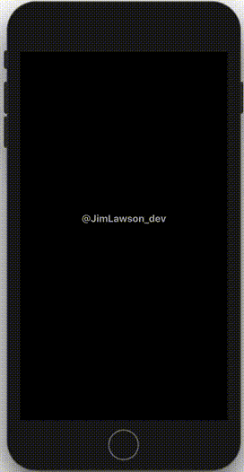
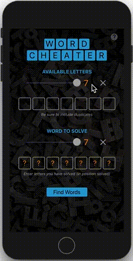

# Word Cheater

## About

This is a mobile app created for solving puzzles for the most-popular, crossword-style games like Word Stacks and Crossword Jam.

## Instructions for Use

### Available Letters

Select the number of letters you have available for the word you are trying to solve by sliding the slider left and right.

Enter the letters by tapping on the first box and typing the letters. Order does not matter.

Be sure to include duplicate letters. For example, if you have two E's in your available letters, enter E twice.

### Word to Solve

Select the number of letters in the word you are trying to solve by sliding the slider left and right.

Enter any letters that have already been revealed for your word by tapping on the ? in one or more of the boxes.

Be sure to enter each letter IN THE SAME POSITION it appears in your game.

